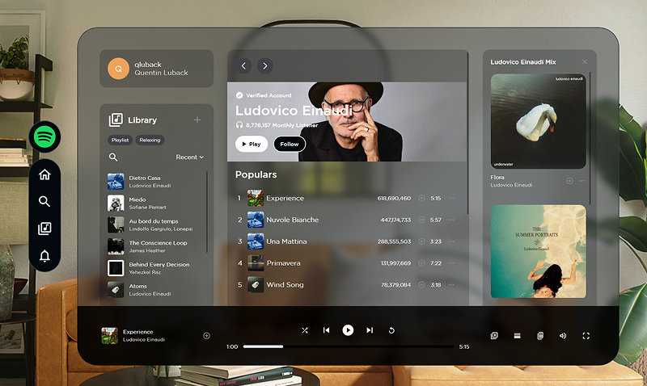

# music-app-glassmorphism
Project to show interface of music app that could be used in VR for example.<br>
Responsive made only for screens larger than 1280px.

[Demo link](https://qluback-music-app-glassmorphism.netlify.app/)



Template made by [Eshika Eshika](https://www.behance.net/gallery/231463977/Glassmorphism?tracking_source=search_projects|glassmorphism&l=86)<br>

## Setup
Download [Node.js](https://nodejs.org/en/download/).
Run this followed commands:

``` bash
# Install dependencies (only the first time)
npm install

# Run the local server at localhost:8080
npm run dev

# Build for production in the dist/ directory
npm run build
```
